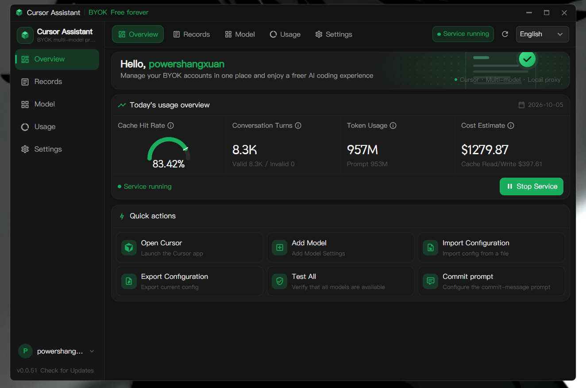

<div align="center">

# cursor-byok (Go)

A local model gateway for Cursor — **Go implementation fork** with continued secondary development.

[Download](https://github.com/Sxuan-Coder/cursor-byok/releases/latest) · [Releases](https://github.com/Sxuan-Coder/cursor-byok/releases) · [Issues](https://github.com/Sxuan-Coder/cursor-byok/issues)

[](https://github.com/Sxuan-Coder/cursor-byok/releases/latest)
[](https://github.com/Sxuan-Coder/cursor-byok/releases)
[](./LICENSE)
[](https://github.com/Sxuan-Coder/cursor-byok/releases/latest)

</div>




## Fork Notice

This repository is a fork of [leookun/cursor-byok](https://github.com/leookun/cursor-byok), based on its **Go implementation** (`v0.0.x`), and continues secondary development on the Go codebase.

The upstream repository has since moved its main line toward a **Rust rewrite** (`0.1.0-beta`). This fork does **not** follow that rewrite — new features and fixes here are built on the original Go implementation, so the two projects will diverge over time.

## Features

- **Bring your own model channels:** configure your own API endpoint, credentials, and model IDs.
- **Multiple API protocols:** OpenAI- and Anthropic-compatible APIs, or a custom endpoint.
- **Model management:** add, duplicate, edit, reorder, and batch-test model configurations.
- **Connection benchmarks:** time to first token, generation speed, raw provider responses.
- **Agent workflows:** tool calling, Skills, MCP, and multi-turn conversations preserved.
- **Cross-platform:** macOS, Windows, and Linux.

## Quick Start

1. Download the latest build for your platform from [Releases](https://github.com/Sxuan-Coder/cursor-byok/releases/latest).
2. Launch the app, open **Model Settings**, and enter the endpoint, API key, and model ID.
3. Test the configuration, return to the dashboard, and start the service.
4. Open Cursor, select the configured model, and start using Agent.

## How It Works

```text
Cursor client
    │
    │ Agent requests and tool results
    ▼
cursor-byok local service
    │
    │ OpenAI- / Anthropic-compatible requests
    ▼
Your model API
```

Protocol adaptation, request forwarding, tool-call coordination, and conversation state all run on your machine. API keys and settings are stored locally; requests go directly to the model provider you configure.

## Development

Requires Go 1.25, Node.js/Yarn, [Task](https://taskfile.dev), and the Wails v3 CLI.

```bash
task dev    # run in dev mode
task build  # build the package for the current OS
```

Releases are automated by pushing a version tag — see [docs/release.md](./docs/release.md).

## Credits

Based on the original [leookun/cursor-byok](https://github.com/leookun/cursor-byok) project and its contributors.

## License

Open source under the [MIT License](./LICENSE).